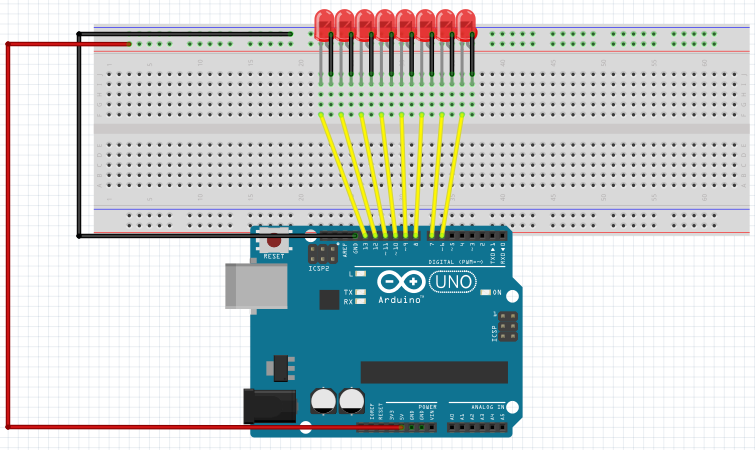
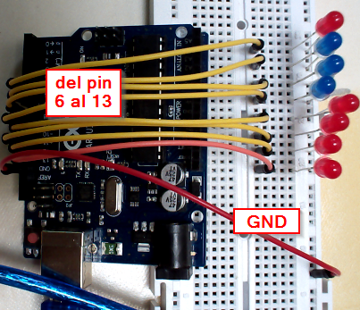

# Ampliación: Juegos de luces

## Construcción

En este caso pondremos 8 LEDs uno a continuación del otro, los ANODOS (+)(pata más larga) conectados al pin 13 - 12 -11 -10 -9 -8 -7 -6 y los CATODOS (-) (pata corta) todos al GND

