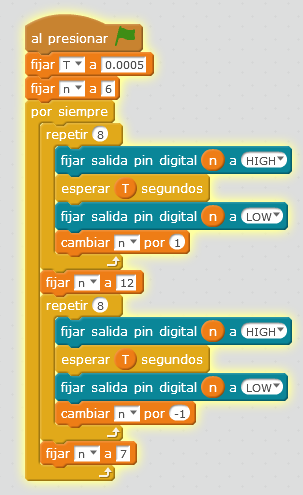

# Coche fantástico

## Propuesta

¿Conoces las luces del coche fantástico? si la respuesta es afirmativa, tienes la edad perfecta para este curso ;), sino, tendrás que ver este vídeo para [ver el coche fantástico](https://www.youtube.com/watch?v=oNeQi8-PXAU)

https://www.youtube.com/watch?v=B9odWhGeLnE

%accordion%Solución%accordion%

Hemos puesto un tiempo T pequeño para que dar una sensación de movimiento

Descarga del [programa aquí](http://aularagon.catedu.es/materialesaularagon2013/arduino/M3/cochefantanstico.sb2).

%/accordion%

