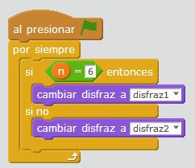

# Coche fantástico plus

## Propuesta

Bueno, y si pedimos que tenga alguna interacción con elementos de Scratch:

<iframe width="425" height="350" src="//www.youtube.com/embed/23RnW9e2gD8" frameborder="0"></iframe>

%accordion%Solución%accordion%

El programa es el mismo que el anterior, pero con bombillas que cambian de disfraz:

Por ejemplo para la bombilla número 6:

El programa te lo puedes [descargar aquí](cochefantanstico-plus.sb2)

## Otra propuesta de coche fantástico

<iframe width="425" height="350" src="//www.youtube.com/embed/ucQRrE1j32g" frameborder="0"></iframe>

<input type="button" name="toggle-feedback-17_93" value="Solución" class="feedbackbutton" onclick="$exe.toggleFeedback(this,false);return false" />

%/accordion%

### Retroalimentación

<iframe width="425" height="350" src="//www.youtube.com/embed/7CoMjsU0aI4" frameborder="0"></iframe>

<iframe width="425" height="350" src="//www.youtube.com/embed/HFzhEpXn6yA" frameborder="0"></iframe>

<iframe width="425" height="350" src="//www.youtube.com/embed/7VJ_nCiII6w" frameborder="0"></iframe>

