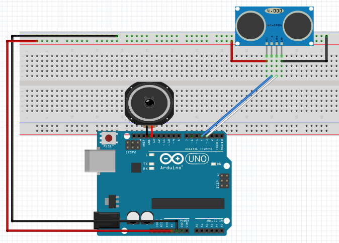

# Con altavoz Arduino

## Propuesta

Realizar un programa que realice pulsos el altavoz en función de la distancia al objeto. Cuanto más cerca mayor es la frecuencia de los pulsos

https://www.youtube.com/watch?v=6Ww-2lFD27M

%accordion%Solución%accordion%

¡¡¡ Es exáctamente igual que el caso anterior !!! Sensor parking con led lo único es cambiar la luz POR UN ALTAVOZ !!!

%/accordion%

