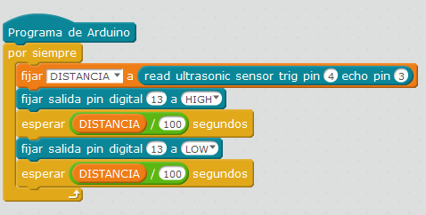

# Con altavoz Arduino

## Propuesta

Realizar un programa que realice pulsos el altavoz en función de la distancia al objeto. Cuanto más cerca mayor es la frecuencia de los pulsos

<iframe width="425" height="350" src="//www.youtube.com/embed/6Ww-2lFD27M" frameborder="0"></iframe>

<input type="button" name="toggle-feedback-6_93" value="Solución" class="feedbackbutton" onclick="$exe.toggleFeedback(this,false);return false" />

### Retroalimentación

¡¡¡ Es exáctamente igual que el caso anterior !!! Sensor parking con led lo único es cambiar la luz POR UN ALTAVOZ !!!

