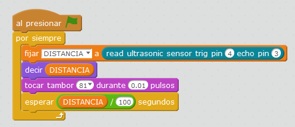

# Con altavoz del PC

## Propuesta

Ahora que no sea un altavoz suelto, sino el del ordenador

https://www.youtube.com/watch?v=wcx3_KiDUpM

Si te fijas _va más lento que [el caso anterior_](/con_el_altavoz_arduino.md) por su dependencia con el ordenador.

%accordion%Solución%accordion%

Si quieres el programa [aquí](http://aularagon.catedu.es/materialesaularagon2013/arduino/M3/ULTRASONIDOS-1.sb2).

%/accordion%