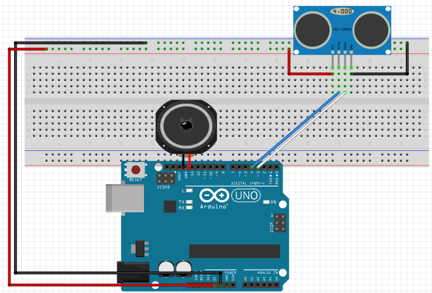

# Con el altavoz Arduino

## Propuesta

Bueno y ahora ¿por qué no repetimos[ el ejercicio anterior ](https://catedu.gitbooks.io/ensena-pensamiento-computacional-con-arduino/content/con_el_altavoz_pc.html)pero nos independizamos del ordenador? conectamos un altavoz en el pin 13 por ejemplo y que suene la música:

No suena de maravilla, porque no es el altavoz del PC, ni tampoco tiene potencia, pero algo es algo...

https://www.youtube.com/watch?v=jgHBIZCJGu0

%accordion%Solución%accordion%

La solución es muy parecida al ejercicio anterior, simplemente hay que cambiar la instrucción de tocar nota por reproducir tono

También el evento bandera la sustituimos por Arduino y así somos independientes del ordenador.

El programa queda así:

%/accordion%

