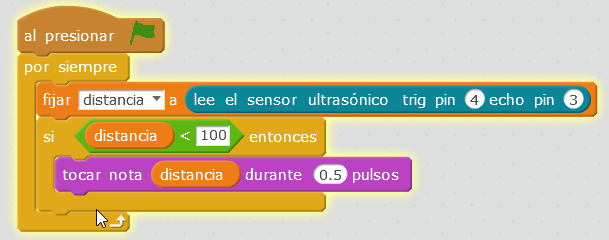

# Con el altavoz PC

## Propuesta

No vamos a hacer un arpa láser estilo Jean Michel Jarre, pero con ultrasonidos, se puede hacer algo parecido. ¿Te atreves? El programa tiene que convertir la distancia en notas musicales.

Las notas musicales están en formato americano (en vez de do-re-mi-..) van desde la nota 48 a la nota 72 por lo tanto hay que convertir la distancia en esas notas musicales

<iframe width="425" height="350" src="//www.youtube.com/embed/pfbXZOVQubA" frameborder="0"></iframe>

<input type="button" name="toggle-feedback-8_93" value="Solución" class="feedbackbutton" onclick="$exe.toggleFeedback(this,false);return false" />

### Retroalimentación

- Ponemos un tope de 100 cm para que empiece a tocar, de lo contrario nos vuelve un poco locos, pues no pararía.
- Como la notación musical es americana, en forma de números es muy fácil:

