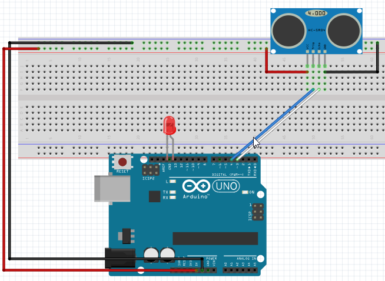
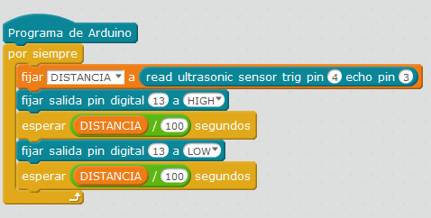

# Con un led

## Propuesta

Realizar un programa que la luz parpadee más deprisa cuanto más cerca esté el obstáculo.

https://www.youtube.com/watch?v=D0yfR4AZoZY

%accordion%Solución%accordion%

El truco está en el tiempo de espera en la intermitencia

Si el tiempo de espera es proporcional a la distancia, parpadeará más cuanto más cerca

%/accordion%

