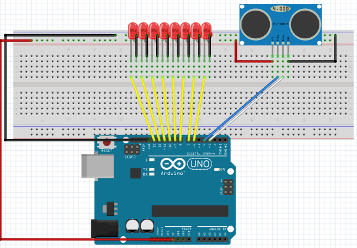
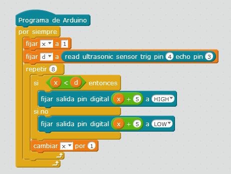

# Con varios leds

## Propuesta

Realizar un programa que visualice con las luces la distancia que detecta el sensor de ultrasonidos.

Cuanto más lejos, más luces encendidas:

https://www.youtube.com/watch?v=2J9z2fWz6EY

%accordion%Solución%accordion%

Y el programa podría ser una variable X que vaya desde 1 hasta 8

Y si la distancia es menor que X que encienda la luz, en caso contrario que lo apague.

Como los LEDs están conectados desde el pin 6 al 13 hay que realizar una sencilla conversión: pin= X + 5

%/accordion%