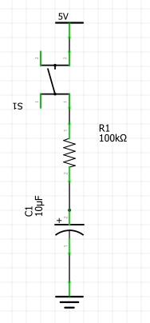
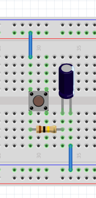
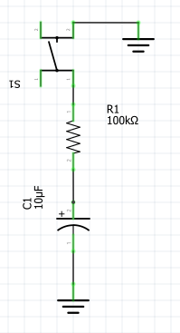
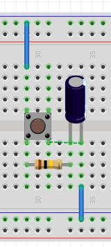

# Condensador

## ¿Qué es?

Es un elemento que consta de dos placas separadas que son capaces de cargarse eléctricamente, su capacidad se mide en Faradios. Se puede interpretar como un globo que nos permite hincharlo de aire, y la capacidad los litros.

**ATENCIÓN** Los condensadores (a partir de μF son electrólíticos) tienen** POLARIDAD QUE ES IMPORTANTE RESPETARLA,** es decir, tienen un pin marcado con el signo (-) normalmente con franja blanca que tiene que ir al (-) o masa (GND 0V) de lo contario, revientan, con el consecuente peligro, más peligrosos cuanto más capacidad tienen.

**ATENCIÓN** Los condensadores tienen una tensión máxima de trabajo, marcado en el propio condensador, en nuestro caso los condensadores marcan 25V, luego se pueden utilizar sin problemas con el Arduino que la tensión máxima es 5V. Como si fuera la máxima presión que aguanta el globo antes de explotar.

## Carga y descarga

Si lo hacemos a través de una resistencia, tarda un tiempo a cargarse y también a descargarse (como si en el globo lo deshincháramos pero estrechando la boca)

El circuito de carga sería

fíjate que el lado (-) (la banda blanca) está conectado a GND

El circuito de descarga sería

## Cálculos

El tiempo de carga y de descarga se calcula con la fórmula :

T = 5 R C

En el caso de los circuitos de arriba T = 5 * 100k * 10μ = 5 * 100 000 * 0.00001 = 5 segundos

Igual que un globo, la carga evoluciona muy rápidamente al principio, pero a medida de que se va llenando, cuesta más, la gráfica de carga de un condensador es la siguiente:

Y para la descarga es la siguiente

