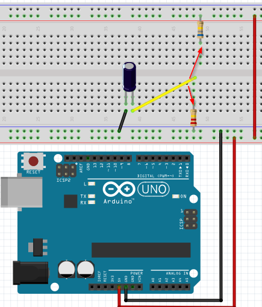
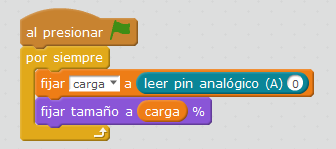

# Condensador

## Propuesta

Realizar un programa que cargue y descargue el condensador y que lo visualice en un objeto.

La propuesta es con un condensador de 10μF y dos resistencias de centenares de k, según[ lo visto en el módulo M1 ](http://aularagon.catedu.es/materialesaularagon2013/arduino/M1/condensador.html)esto nos dará un tiempo de carga y descarga de varios segundos

OJO CONECTAR EL PIN (-) DEL CONDENSADOR A GND

Las resistencias colocarlos de tal manera que uno sea para la carga y otro para la descarga

Un cable suelto, en uno extremo el terminal (+) del condensador y el otro suelto preparado para tocar la resistencia de carga o la de descarga.

- C

Visualizar la carga en un objeto Scratch que aumente de volumen:

<iframe width="425" height="350" src="//www.youtube.com/embed/08FM_y8rujc" frameborder="0"></iframe>

<input type="button" name="toggle-feedback-15_93" value="Solución" class="feedbackbutton" onclick="$exe.toggleFeedback(this,false);return false" />

### Retroalimentación

Es muy sencillo, fija el tamaño de la pelota al valor del pin A0

Lo hemos hecho a través de una variable auxiliar "carga" para poder visualizar numéricamente su valor.

El programa te lo puedes [descargar aquí](condensador.sb2) (sb2 - 15.35 <abbr lang="en" title="KiloBytes">KB</abbr>).

NOTA: Se puede aprovechar esta experiencia para:

- Calcular el tiempo de carga, si coincide con la fórmula T = 5RC
- Visualizar que la pelota se carga o aumenta de volumen muy rápidamente al principio y luego lentamente, tal y como indica[ la teoría vista en el módulo 1](http://aularagon.catedu.es/materialesaularagon2013/arduino/M1/condensador.html)
- Igualmente en la descarga

