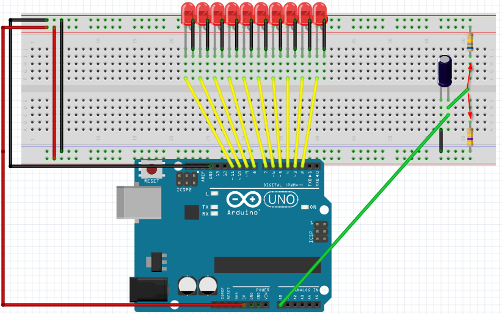
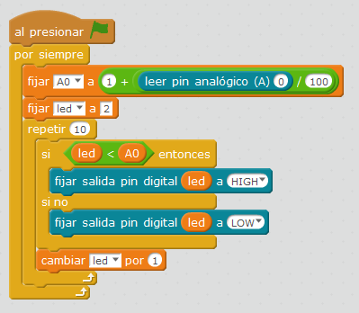

# Condensador y LEDs

## Propuesta

En este ejercicio proponemos que se visualice la carga y descarga de un condensador, no en una pelota que se hincha como hicimos en el M2, sino con las luces

Utilizaremos el formato de LEDs del ejercicio anterior, es decir 10 LEDs colocados consecutivamente, desde el pin 2 hasta el pin 11

La entrada será el condensador por el pin A0

El cable verde suelto será el que manualmente tocará a una resistencia o a otra para que se cargue o descargue:

https://www.youtube.com/watch?v=_O1GhMW3Z3U

%accordion%Solución%accordion%

Pero si... ¡¡¡ ES EL MISMO QUE EL EJERCICIO ANTERIOR[ LDR Y LEDS](https://catedu.gitbooks.io/ensena-pensamiento-computacional-con-arduino/content/ldr_y_leds.html) !!!

Si te lo quieres descargar ves a [ LDR Y LEDS](http://aularagon.catedu.es/materialesaularagon2013/arduino/M3/ldr_y_leds.html)

%/accordion%

