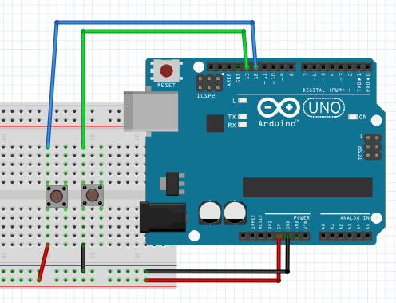

# Esto esta mal

## Directo: Esto esta mal

La sencilla razón es la siguiente ¿cuando el interruptor o pulsador esté abierto qué tensión tendrá "Pin digital"?

En vista de protoboard sería así:

El primer pulsador cuando se cierra si que proporciona 5V al pin 12 por el cable azul pero... ¿y cuando no está pulsado?

El segundo pulsador cuando se cierra sí que proporciona 0V al pin 13 por el pin verde pero... ¿y cuando no está pulsado?

Ah!! y por supuesto ni se te ocurra esto, provocarías un cortocircuito:

