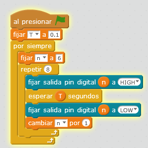

# Juego de luces -2

## Propuesta

En este caso da la sensación que es una luz la que se desplaza:

<iframe width="425" height="350" src="//www.youtube.com/embed/rFRS73GW5Y0" frameborder="0"></iframe>

<input type="button" name="toggle-feedback-42_93" value="Solución" class="feedbackbutton" onclick="$exe.toggleFeedback(this,false);return false" />

### Retroalimentación

Se ha optado por utilizar una variable que controle el tiempo T por comodidad

Puedes descargarte [el programa aquí](juegoleds2.sb2) (sb2 - 72.87 <abbr lang="en" title="KiloBytes">KB</abbr>).

