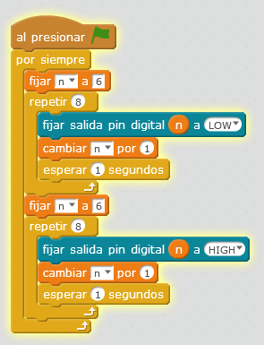

# Juego luces - 1

## Propuesta

Se van encendiendo y apagando los 8 leds secuencialmente como en el vídeo:

https://www.youtube.com/watch?v=Ov_jvJmqTX8

%accordion%Solución%accordion%

Puedes [descargarlo aquí](http://aularagon.catedu.es/materialesaularagon2013/arduino/M3/juegoleds.sb2).

%/accordion%

