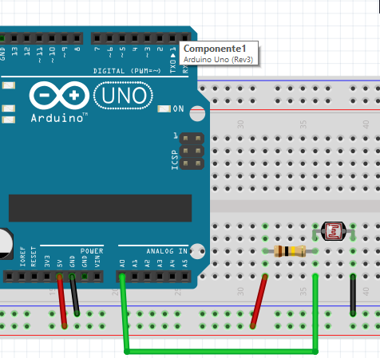

# LDR

LDR= Light Depended Resistor es una resistencia que disminuye su valor cuando aumenta la luz.

Si se coloca en serie con una resistencia de un valor parecido, el punto de unión (cable verde) tiene una tensión variable con la luz que lo puede leer Arduino, en este esquema lo lee por la entrada A0

Si hay luz, el LDR disminuye su resistencia por lo tanto disminuye el valor de la tensión en A0, y viceversa.