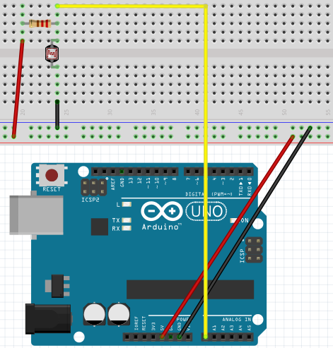
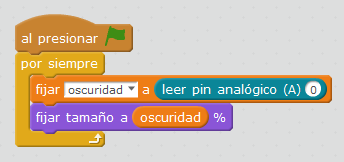

# LDR

## Propuesta

Realizar un programa que visualice en un objeto Scratch la cantidad de luz

El circuito es el siguiente: el LDR conectado a A0 y a una resistencia (la resistencia PULL UP para que la tensión que mida A0 sea la del LDR) y un objeto que aumente de tamaño según el valor de A0

Y el vídeo

https://www.youtube.com/watch?v=b89sS6mQ4_Q

%accordion%Solución%accordion%

El programa es el siguiente:

OOOPAAAA !!! ¡¡ Pero si es el mismo que el que acabamos de ver !!! [El condensador](https://catedu.gitbooks.io/ensena-pensamiento-computacional-con-arduino/content/condensador1.html)

Simplemente se ha cambiado el nombre de la variable, allí se llamaba **carga** y aquí **oscuridad** ¡¡¡ vaya tontería !!!

%/accordion%

