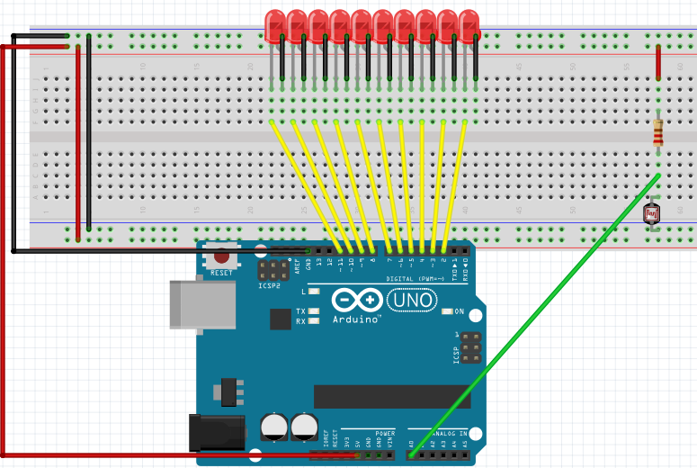

# LDR y LEDs

## Propuesta

Esta vez vamos a convertir el valor de la oscuridad en luces. Para ello necesitaremos:

- **10 LEDs** puestos consecutivamente. Vamos a colocarlos desde el pin 2 hasta el 11 (el 1 está ocupado con TX)
- El sensor LDR conectado a una entrada A0
- El programa tiene que convertir el valor de la oscuridad que detecta el LDR en las luces, es decir cuanto más oscuridad más luces encendidas.

<iframe width="425" height="350" src="//www.youtube.com/embed/78hqYoimEV4" frameborder="0"></iframe>

<input type="button" name="toggle-feedback-9_93" value="Solución" class="feedbackbutton" onclick="$exe.toggleFeedback(this,false);return false" />

### Retroalimentación

La solución tiene la complejidad del valor de la entrada A0 que va desde 0 hasta 1023 por lo tanto, hay que convertir estos valores en valores del 2 al 11 correspondiente a los LEDs

La forma más sencilla de reconvertir A0 es dividir A0 entre 100 y sumarle un 1 de esta manera aproximadamente los valores se convierten en 2-11

Si el LED se menor que el valor A0 ya convertido, encender el LED, en caso contrario apagarlo

El programa te lo puedes [descargar aquí](ldr-luces.sb2) (sb2 - 72.89 <abbr lang="en" title="KiloBytes">KB</abbr>).

