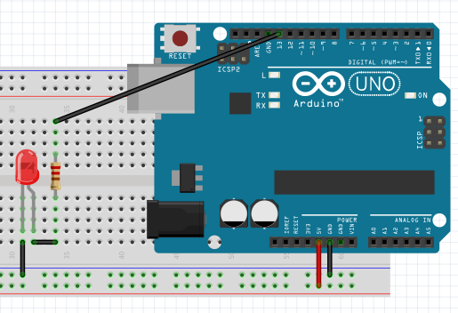
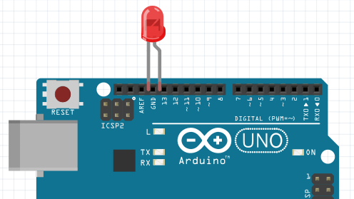

# LED

 LED= light-emitting diode: es un diodo emisor de luz que tiene polaridad, es decir, que tiene + y -

## ¿Cómo se conecta?

Pues a través de una resistencia, de valor de algunos k o centenares de Ω, cuanto más pequeña más se ilumina pero más peligro de fundir el led

En el ejemplo : conexión a la salida del pin 13 :

NOTA: A veces conectaremos el LED diréctamente, por simplificar, pues el ARDUINO TIENE UNA RESISTENCIAS INTERNAS DE 30k pero no es una buena práctica

