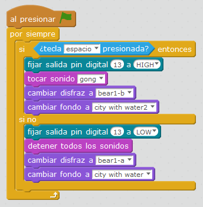

# Luz interactiva

## Propuesta

Realizar un programa que al pulsar la tecla espacio, se encienda el led, un personaje cambie el disfraz, cambie el fondo y suene un "gong"

<iframe width="425" height="350" src="//www.youtube.com/embed/oiOvVsE_6fc" frameborder="0"></iframe>

<input type="button" name="toggle-feedback-6_93" value="Solución" class="feedbackbutton" onclick="$exe.toggleFeedback(this,false);return false" />

### Retroalimentación

El programa es sencillo si se conoce Scratch y las instrucciones de control

El programa completo [te lo puedes descargar aquí](oso.sb2) (sb2 - 971.87 <abbr lang="en" title="KiloBytes">KB</abbr>).

