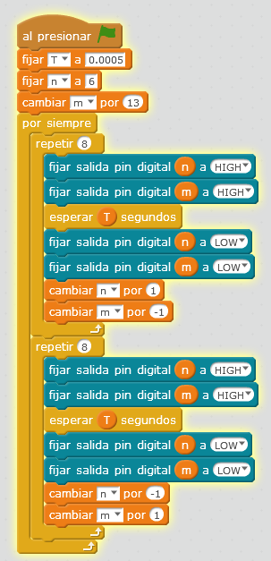

# Otras propuestas

## Propuesta

Pues ahora que sean dos luces las que se muevan, los dos en sentidos opuestos

<iframe width="425" height="350" src="//www.youtube.com/embed/GOSBe0IfFQw" frameborder="0"></iframe>

<input type="button" name="toggle-feedback-45_93" value="Solución" class="feedbackbutton" onclick="$exe.toggleFeedback(this,false);return false" />

### Retroalimentación

Puedes descargarte[ el programa aquí](cochefantanstico2.sb2) (sb2 - 72.94 <abbr lang="en" title="KiloBytes">KB</abbr>).

