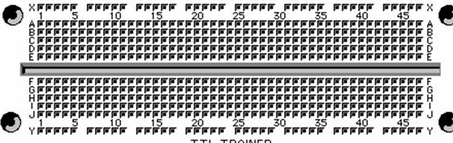
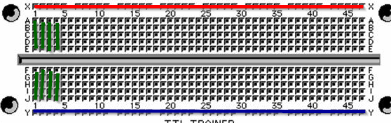

# Placa Protoboard

Placa protoboard o placa de pruebas es un tablero con orificios

Estos se encuentran conectados eléctricamente entre sí de manera interna,el patrón de conexión es de líneas según este esquema:

 

## ¿Cómo está conectado?

La línea X (pintada de rojo) está toda conectada y la línea Y (pintada de azul) también.

Las líneas verticales 1 al 47 están conectadas verticalmente separados por la línea del medio, pero no horizontalmente (he pintado de verde las 4 primeras) es decir:

- A1 SI está conectado con B1C1D1E1
- A1 NO está conectado con A2B2C2D2E2 
- A1 NO está conectado con F1G1H1I1J1

## ¿Cómo se utiliza?

La línea X (pintada de rojo) se suele utilizar para poner la alimentación (5V en nuestro caso) y la línea Y (pintada de azul) se suele conectar a 0V

Lás líneas verdes es donde se conectan los componentes de tal manera que se pueda construir el circuito

