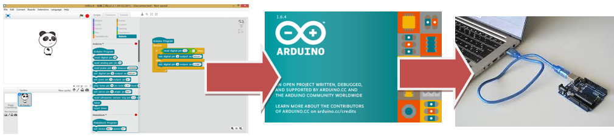

# Programas para programar Arduino

## Arduino IDE
El Arduino tiene su software propio, con su lenguaje de programación y por supuesto es software libre:

[https://www.arduino.cc/en/Main/Software](https://www.arduino.cc/en/Main/Software)

Pero el lenguaje de programación está basado en C++, si quieres programar Arduino con todas sus posibilidades, éste es tu lenguaje y éste es tu curso en Aularagón [Programa Arduino con código.](https://www.gitbook.com/book/catedu/programa-arduino-mediante-codigo/details)
## Scratch
Un lenguaje de programación apropiado para los niños de primaria es el Scratch, muy visual e intuitivo. **Este curso supone que sabes Scratch, sino, tienes que estudiar [nuestro curso de Scratch](https://www.gitbook.com/book/catedu/ensena-pensamiento-computacional-con-scratch/details)**

 [https://scratch.mit.edu/ ](https://scratch.mit.edu/%20)

La pregunta es:
## ¿Hay algún programa adaptado para usarlo en Arduino y basado en el lenguaje adaptado Scratch?

La respuesta es SI, y no sólo uno, **nosotros elegimos mBlock** ¿por qué? puedes ver el razonamiento y otros programas para programar el Arduino en formato gráfico tipo Scratch en nuestro curso de [Echidna ](http://moodle.catedu.es/)

## mBlock

Es un programa especializado en el manejo de los robots de Makeblock (ver cursos de mBot en [Aularagon](http://moodle.catedu.es/), estos robots están basados en Arduino por lo tanto este programa también puede programarlos

Se puede descargar gratuitamente en[ http://www.mblock.cc/](http://www.mblock.cc/)

Para linux ver [http://www.makeblock.es/foro/topic/25/mblock-con-linux](http://www.makeblock.es/foro/topic/25/mblock-con-linux)

## Un detalle

mBlock (y los otros S4A, Snap4Arduino... también) NO PROGRAMA DIRECTAMENTE EN EL ARDUINO si no que traduce el lenguaje SCRACTH al propio del Arduino y éste software es el que programa la placa:

Esto se verá mejor cuando programemos en mBlock, veremos como salta el software Arduino traduciendo todo lo que hemos puesto en mBlock

### ¿y esto importa?

Pues la verdad es que no, pero es bueno que lo sepas para que entiendas lo que significan las ventanas que se muestran.
