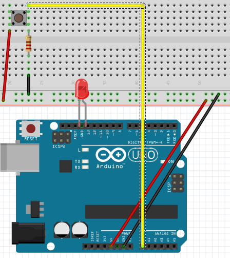

# Pulsador basico

## Propuesta

Realizar un programa con la configuración de pulsador pull down en la entrada analógica A0 y un led en el 13, que cuando se pulse se encienda el LED

<iframe width="425" height="350" src="//www.youtube.com/embed/je7V-1WSidU" frameborder="0"></iframe>

<input type="button" name="toggle-feedback-13_93" value="Solución" class="feedbackbutton" onclick="$exe.toggleFeedback(this,false);return false" />

### Retroalimentación

Por la entrada A0 cuando el pulsador está abierto hay 0V y cuando está cerrado hay 5V, luego los valores que tiene A0 son 0 y 1023 respectivamente

Pero eso **en teoría** pues si realizamos este programa:

Ocurre esto:

<iframe width="425" height="350" src="//www.youtube.com/embed/zCNcD2EQbQw" frameborder="0"></iframe>

¿Por qué? seguramente cualquier defecto de conexión o si la resistencia es elevada, la tensión se queda flotante y ya el valor de A0 no es 0 sino va tomando valores, que algunas veces son 0 pero otras veces no lo son (por eso no está totalmente iluminado)

Luego lo mejor es subir el valor, hemos puesto 500 y sí que funciona correctamente

