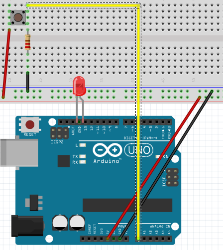
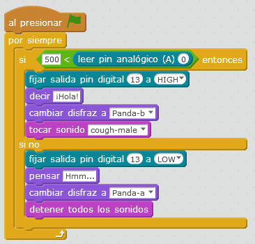

# Pulsador interactivo

## Propuesta

Realizar un programa que al apretar el pulsador, que el panda cambie de disfraz, haga un sonido, diga algo ... además de encender el LED con la misma configuración que [la propuesta anterior](pulsador_basico.html)

https://www.youtube.com/watch?v=7z6QZy22lG8

%accordion%Solución%accordion%

Es simplemente añadir más instrucciones a la propuesta del pulsador básico:

Si quieres [descargarte el programa completo aquí](http://aularagon.catedu.es/materialesaularagon2013/arduino/M2/interruptor-pc-2.sb2)

%/accordion%

