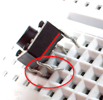

# Pulsadores

Un pulsador nos permitirá crear entradas digitales al Arduino

Los pulsadores proporcionados abren y cierran los pines que están en vertical, pero no en horizontal pues están conectados (ver figura de la izquierda)

Luego tenemos que fijarnos en los pines, si están en línea son los pines que no están conectados cuando no se pulsa, por lo tanto son estos los que tienen que ir en líneas diferentes de la placa protoboard.

Los pines que están en paralelo están conectados, por lo tanto tienen que estar en la misma línea:

Pero ¿Cómo se conecta? un poco de teoría:

