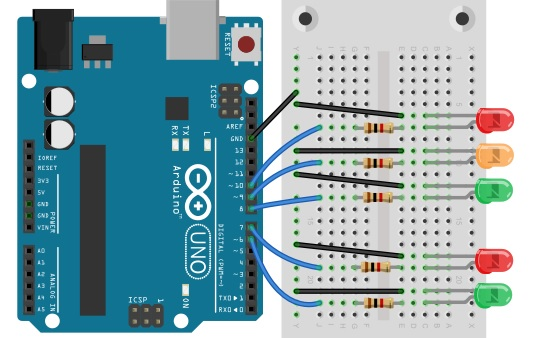
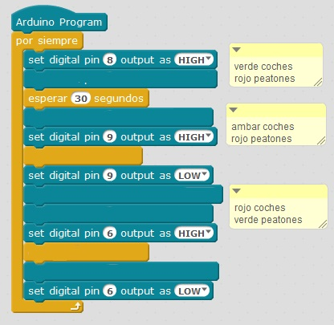

# Semaforo

## Propuesta 1

Realizar un semáforo de luces para coches y peatones:

[Fuente: Con permiso del autor David López Morte (IES Los Albares) [https://davidlopezmorte.wordpress.com/]](https://davidlopezmorte.wordpress.com/) la propuesta del semáforo aquí [[http://www.ieslosalbares.es/tecnologia/programacionArduinoMBlock/semforo.html](http://www.ieslosalbares.es/tecnologia/programacionArduinoMBlock/semforo.html)]

<td align="center">Coches</td><td align="center">  </td><td align="center">  Peatones</td><td align="center">  </td><td align="center">Tiempo</td>
<td align="center">Verde (8)</td><td align="center"></td><td align="center">Rojo (7)</td><td align="center"></td><td align="center">30 seg.</td>
<td align="center">Ambar (9)</td><td align="center"></td><td align="center">Rojo (7)</td><td align="center"></td><td align="center">5 seg.</td>
<td align="center">Rojo (10)</td><td align="center"> </td><td align="center">Verde (6)</td><td align="center"> </td><td align="center">20 seg.</td>

<input type="button" name="toggle-feedback-14_93" value="Solución" class="feedbackbutton" onclick="$exe.toggleFeedback(this,false);return false" />

### Retroalimentación

## Reflexión

## Propuesta 2

<iframe width="425" height="350" src="//www.youtube.com/embed/NUY_cErtP8s" frameborder="0"></iframe>

<input type="button" name="toggle-feedback-18_93" value="Solución" class="feedbackbutton" onclick="$exe.toggleFeedback(this,false);return false" />

### Retroalimentación

<iframe width="425" height="350" src="//www.youtube.com/embed/7F9hH7SGfyk" frameborder="0"></iframe>

<iframe width="425" height="350" src="//www.youtube.com/embed/_4ZOp9TZr6w" frameborder="0"></iframe>

<iframe width="425" height="350" src="//www.youtube.com/embed/53Git9YiRvA" frameborder="0"></iframe>

## Propuesta 3

Esta propuesta está en S4A pero ES EXACTAMENTE IGUAL QUE HACERLO EN MBLOC ¿por qué? porque es lenguaje Scratch

<iframe width="425" height="350" src="//www.youtube.com/embed/-AqK_drNX2k" frameborder="0"></iframe>

<input type="button" name="toggle-feedback-16_93" value="Solución" class="feedbackbutton" onclick="$exe.toggleFeedback(this,false);return false" />

### Retroalimentación

<iframe width="425" height="350" src="//www.youtube.com/embed/HS1cAd1u9LU" frameborder="0"></iframe>

<iframe width="425" height="350" src="//www.youtube.com/embed/PlAV36CI_No" frameborder="0"></iframe>

