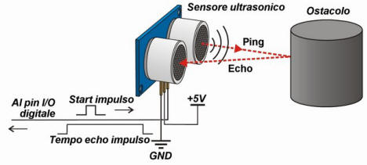
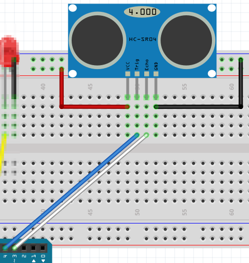

# Sensor ultrasonidos

El sensor dispone de un emisor T que emite una señal de ultrasonidos (a veces no es ultrasonidos, pues algunos lo pueden oir) y un receptor R que capta el eco del objeto que está delante de él. Su rango de detección va desde 2cm a 450cm

Tiene cuatro pines, dos son la alimentación que conectaremos Vcc a 5V, GND a 0V y los otros dos son los importantes:

- Trigger que emite un pulso
- Echo que recibe el pulso

Según el tiempo entre el pulso y el eco (T), la distancia a la cual se encuentra el objeto es : distancia = T * velocidad_sonido/2

Podemos conectar el pin trigger y echo donde queramos de las entradas y salidas digitales del Arduino, en este curso vamos a tomar como criterio:

- Trigger en el pin 4
- Echo en el pin 3

No tenemos que utilizar la fórmula para calcular la distancia, mBlock ya lo hace y la instrucción es muy sencilla, sólo hay que proporcionarle qué pin hemos conectado el trigger y qué pin hemos conectado el echo y él nos devuelve la distancia en centímetros:

