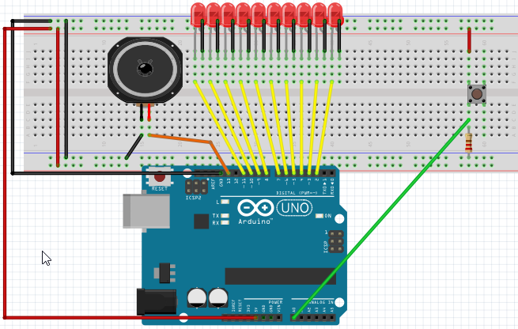
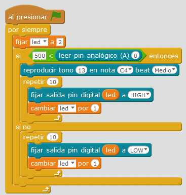

# Timbre

## Propuesta

Proponemos que cuando se pulse el pulsador, se enciendan las luces y toque un tono

https://www.youtube.com/watch?v=tDT2SgXXE5A

El pulsador con la resistencia pull-down al pin A0 y las luces como en los ejercicios anteriores del 2 al 11, el altavoz en el pin 13:

%accordion%Solución%accordion%

El programa te lo puedes [descargar aquí](http://aularagon.catedu.es/materialesaularagon2013/arduino/M3/timbre.sb2).

%/accordion%

