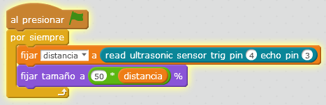

# Ultrasonidos

## Propuesta

Pues ya que estamos con la pelota, pues también seguimos: Hacer un programa que se hinche la pelota según la distancia.

En este caso, como la el sensor de ultrasonidos va desde 2 cm a 300 cm, nuestra propuesta es que el tamaño se cambie multiplicado x50 ese valor, es decir "cambiar tamaño 50xdistancia", de no hacer esto, la pelota sale demasiado pequeña, o el objeto tendría que estar muy lejos para que se vea a un tamaño razonable.

<iframe width="425" height="350" src="//www.youtube.com/embed/2Pc2Rg0RqEo" frameborder="0"></iframe>

La configuración la explicada en el módulo 1 es decir:

- Trigger en el pin 4
- Echo en el pin 3

<input type="button" name="toggle-feedback-17_93" value="Solución" class="feedbackbutton" onclick="$exe.toggleFeedback(this,false);return false" />

### Retroalimentación

Pues el programa es muy parecido a los anteriores:

Si quieres el programa [aquí lo tienes](ultrasonidos1.sb2) (sb2 - 15.39 <abbr lang="en" title="KiloBytes">KB</abbr>).

